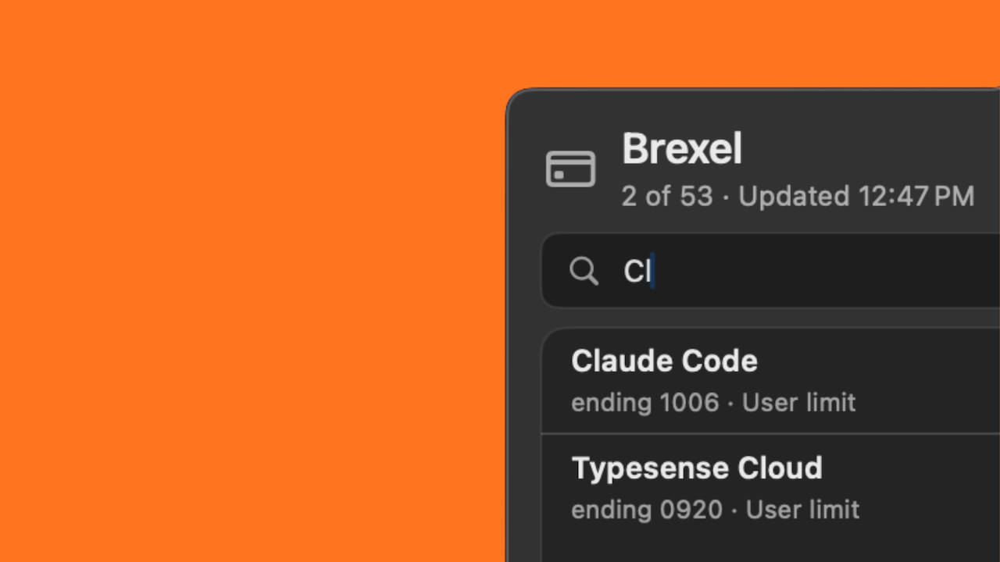

# Brexel

A macOS menu bar app that puts your Brex cards one click away. View available cards and copy the number, expiration, CVV, cardholder, billing address, or all details to your clipboard — without opening a browser.

> **Not affiliated with, endorsed by, or sponsored by Brex Inc.** This is an unofficial third-party client built on top of Brex's [public Developer API](https://developer.brex.com/) using a token you create yourself.



## Requirements

- macOS 13 (Ventura) or later
- Swift 5.9+ toolchain (Xcode 15+ or a Swift.org toolchain)
- An active Brex account with permission to create API tokens

## Quick start

```sh
git clone https://github.com/saadmalik/brexel.git
cd brexel
swift run Brexel
```

A creditcard icon appears in your menu bar — click it to open the popover. On first launch you get an onboarding flow that walks you through creating a Brex API token; paste the token and your cards load.

The token is stored in your macOS Keychain under service `com.local.brexel`. It is never written to disk anywhere else.

## Brex API token scopes

| Scope | Required | Purpose |
| ----- | -------- | ------- |
| **Cards** — Read only | Yes | List your cards (`GET /v2/cards`) |
| **Card Numbers Read and Send** — Read only | Yes | Fetch number, expiration, CVV on demand (`GET /v2/cards/{id}/pan`) |
| **Users** — Read only | Optional | Show monthly limit amounts on user-limit cards (`GET /v2/users/{id}/limit`). Without this scope those cards still work — the limit shows as a generic `User limit` label instead of the dollar amount. |

## Build a `.app`

```sh
Scripts/build-app.sh
open "dist/Brexel.app"
```

The script bundles the binary, generates a multi-resolution `.icns` from `Resources/brexel-icon.png`, and signs the app.

**Code signing.** If you have a `Developer ID Application` or `Apple Development` identity in your keychain, the script picks one up automatically. If you don't, it falls back to ad-hoc signing — the app still runs locally; you just won't be able to distribute it. To pin a specific identity, set `BREX_CODESIGN_IDENTITY` in the environment. A stable identity helps macOS Keychain remember `Always Allow` across rebuilds.

## Launch at login

Open the popover, click `…` in the top right, and toggle **Launch at Login**. macOS may prompt you to approve the app under **System Settings → General → Login Items**.

## Privacy and security

- The Brex API token lives in the macOS Keychain only (`kSecAttrAccessibleAfterFirstUnlockThisDeviceOnly`). There is no config file or `.env` involved at runtime once the token is saved.
- The full card number and CVV are **never persisted** by this app. They are fetched from Brex on demand when you click a copy action and copied directly to the clipboard.
- The app makes network requests only to `api.brex.com`. There is no telemetry, no analytics, and no third-party services.
- The source is in this repo — read it yourself.

## Contributing

Issues and pull requests welcome. For larger changes please open an issue first to discuss the approach.

## License

[MIT](LICENSE).
